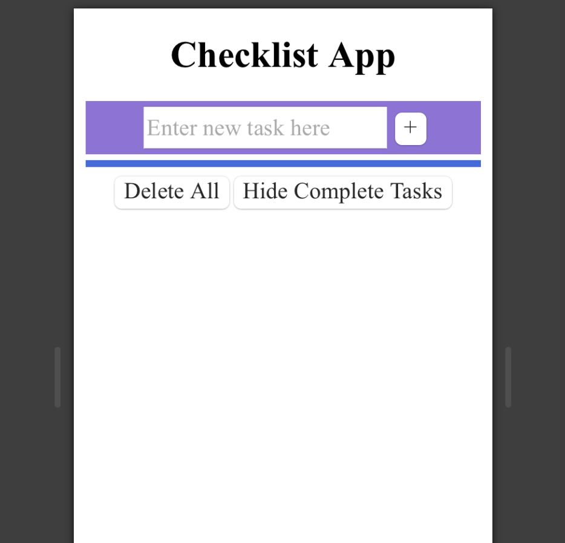
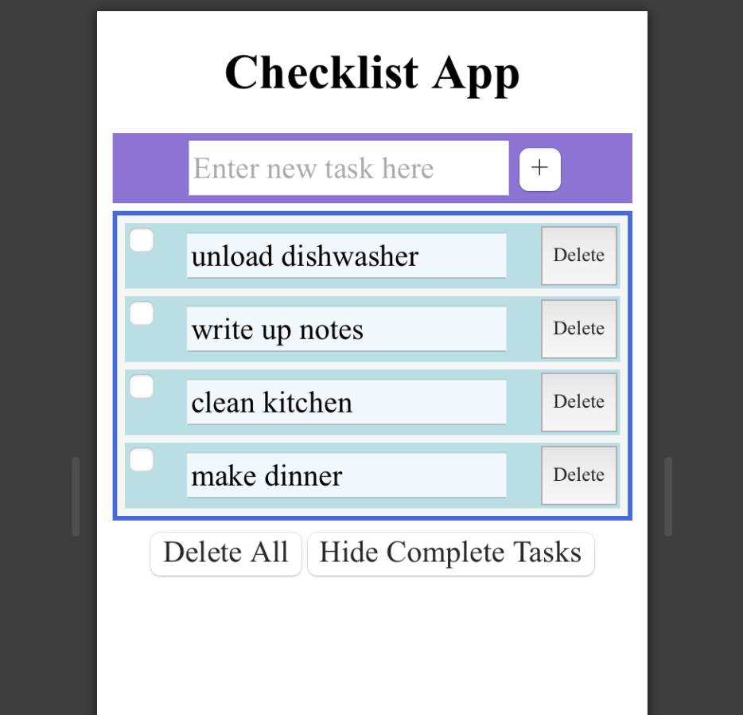
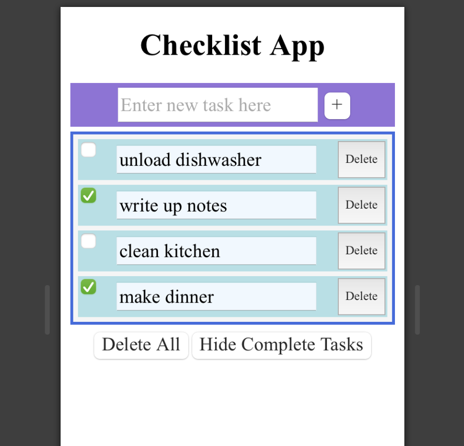
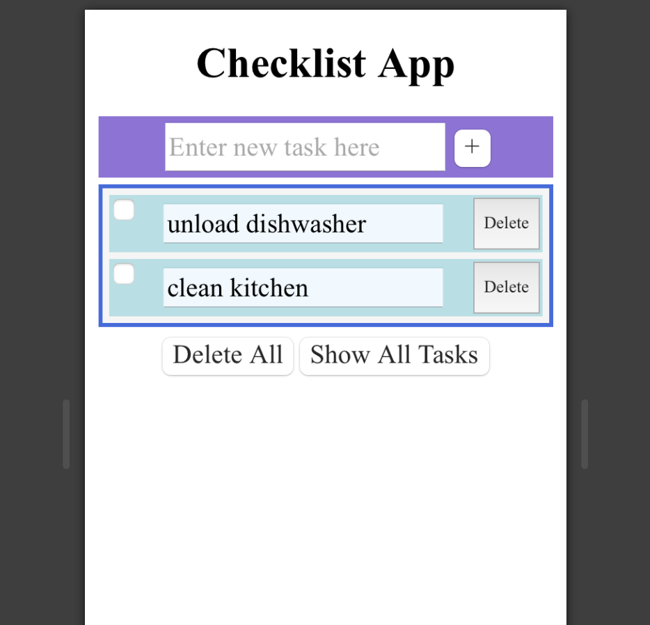
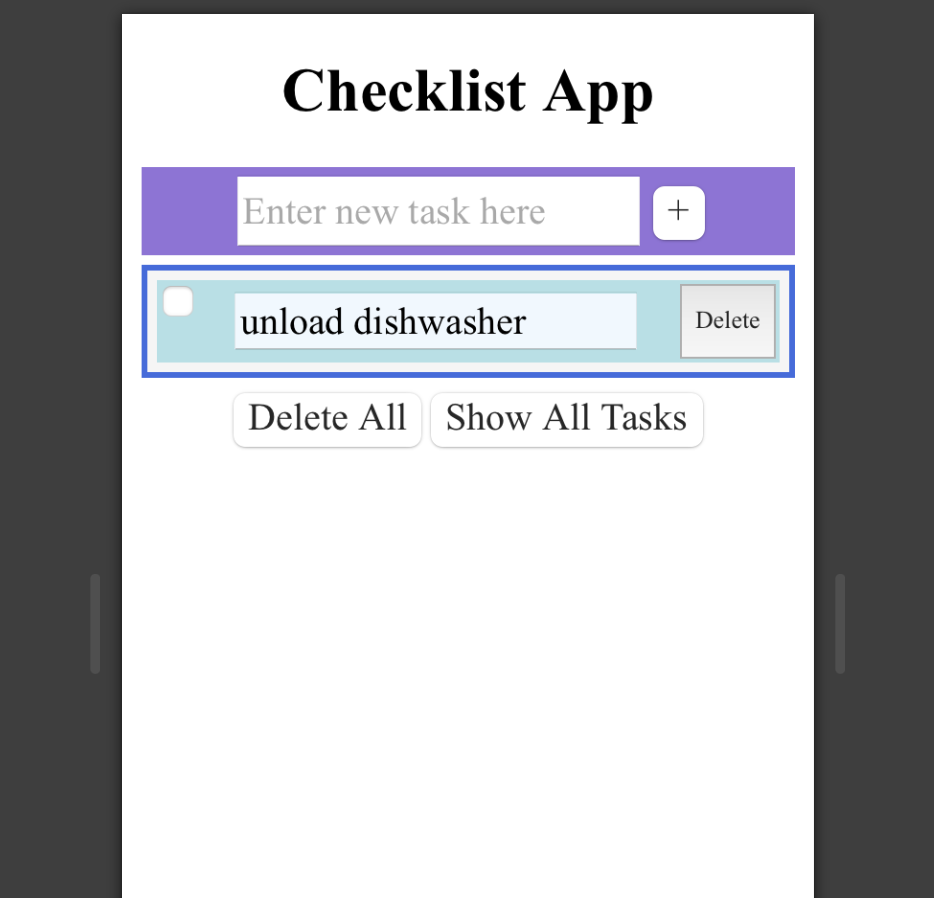

Design Choices Discussion
------------------------------------------------------
**Our Design Decisions**  
We made a number of significant design changes from Lab 1, as our design did not work particularly well for a smaller
interfaces. In this vein, we increased the size on all of our text, and made the various items on our app larger. This
resulted in the App being readable on a smaller screen. We also decided to make the colors present in the styling more
consistent with each other so it would be less harsh visually.

For functionality, the major change we made was getting rid of a tabular setup where the user could switch tabs between
an all tasks tab and an incomplete tasks tab. Instead, we replaced this with a button where the user could click between
showing all tasks and showing incomplete tasks. This was largely due to our ability to more easily implement buttons,
but we also thought buttons would be better for usability.

Another functional change we made was getting rid of the edit button. This was entirely due to implementation and
restrictions on time. We spent awhile trying to implement the edit button, but we ran into issues with getting other
components to work. Thus, we used an editable field that allows the user to click and edit the field.

Several design elements were maintained from previous iterations. We kept creating a new task at the top of the
page so that user could access the most essential item of teh checklist - putting items on the checklist. We maintained
the delete button that allows users to get rid of checklist items once they are on the list. And lastly we kept the
Delete All button at the bottom of the app, because we found it worked well for its intended use.
 
 

**Alternative Designs**  

**User Testing**  
The user testing went well, the user was able to accomplish all the tasks we set out for them. The one issue they had 
was with finding the checkbox. After looking at the App we realized we did not implement the color backgrounds for each 
individual task. We then proceeded to implement this feature.

Final Design Images
------------------------------------------------------
This is the opening image of the app. The user can now proceed to insert a new task in the text box and press the '+'
button to add the task to their checklist. The user may press any of the other buttons at this point if they so like, but
they will not do anything.

-----

Once a user inserts a task the app will look like the following.

----

The user then has the option to add more tasks or work with just the single task in the checklist. The following example 
is what the app will look like if the user adds more tasks.

----

Once tasks are complete the user can click on the checkbox and mark a task as complete.

----

At this point, if the user wants to make their checklist easier to read but don't want to delete their completed items 
just yet, they can hide complete tasks by clicking the corresponding button, and they will end up with a screen similar 
to the one below.

----

The user can then work with the checklist at this point or press the show all tasks button to return to the view shown 
in the previous screenshot.

If the user wishes to delete a specific task, they can simply press the delete button and the task will be deleted.

----

Lastly, if the user wishes to clear their tasks they can press the delete all button and return to back to the opening 
view of the App.

  

Reflection
------------------------------------------------------
**Challenges** 
One challenge we had was with getting the button to display incomplete tasks only working. 

Another challenge was getting the checkboxes working while simultaneously keeping track of the checked property.
 
 
**What We Are Most Proud Of** 
We are most proud of the fact that we were able to get our button toggling between showing all the tasks and showing 
the incomplete tasks. This feature took quite a lot of time to get right and involved a lot of different dependencies, 
making it hard to troubleshoot. We were able to get it done though, and it works exactly how we expected it to work.

