Overall Design Choices
------------------------------------------------------

Task 1
------------------------------------------------------
Start:
Requires task1_start_intermediate.html and style.css
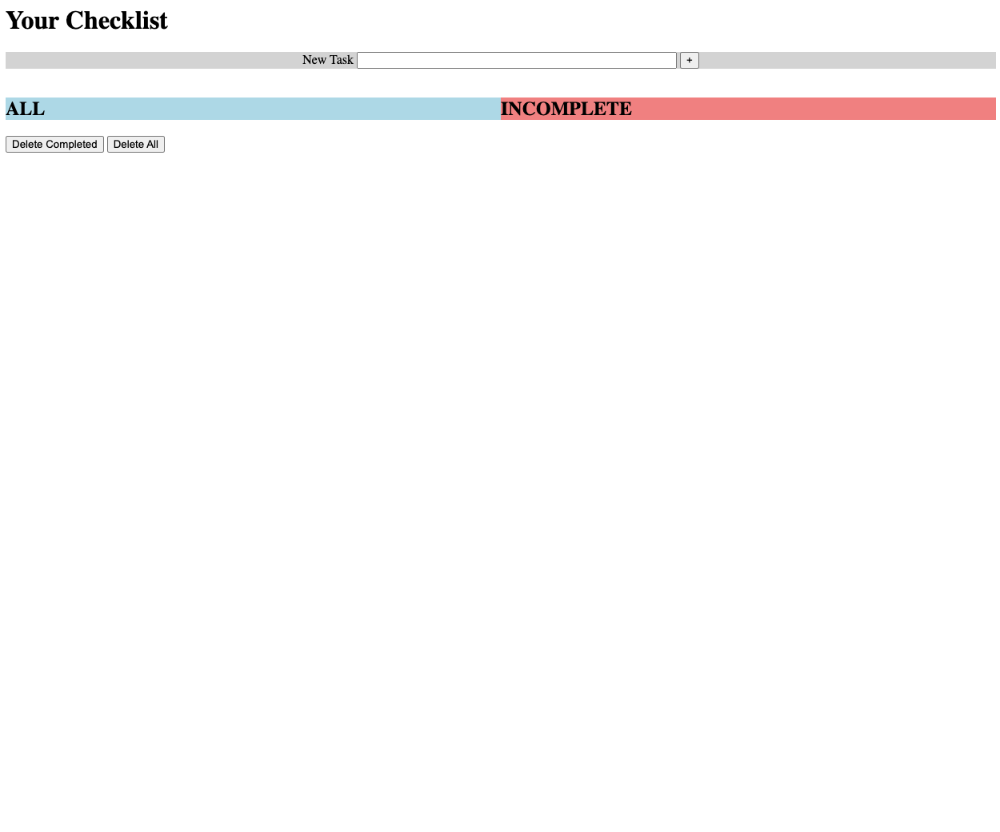
Intermediate:
Requires task1_start_intermediate.html and style.css
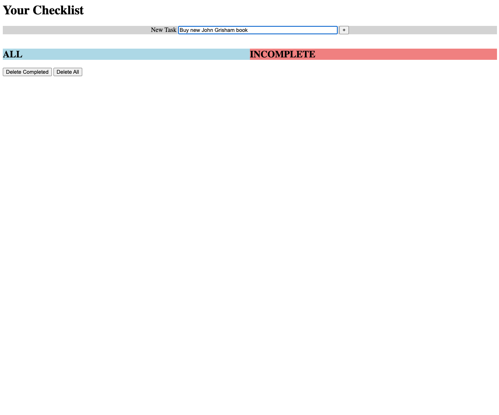
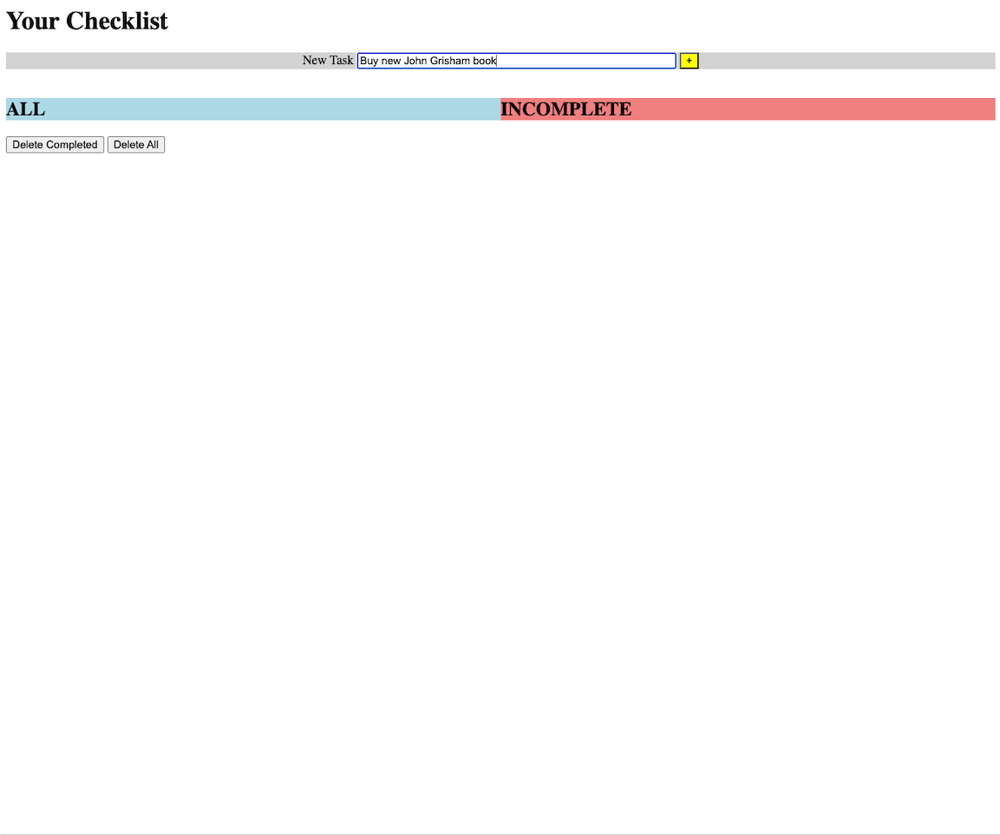
End:
Requires task1_end.html and style.css
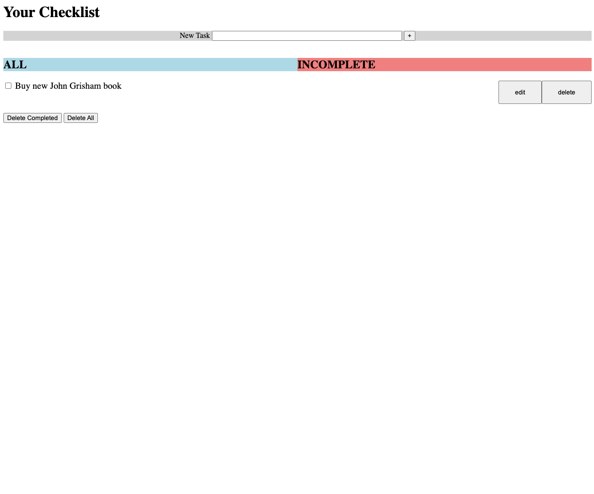

Task 2
------------------------------------------------------
Start:
Requires task2_start_intermediate.html and style.css

Intermediate:
Requires task2_start_intermediate.html and style.css
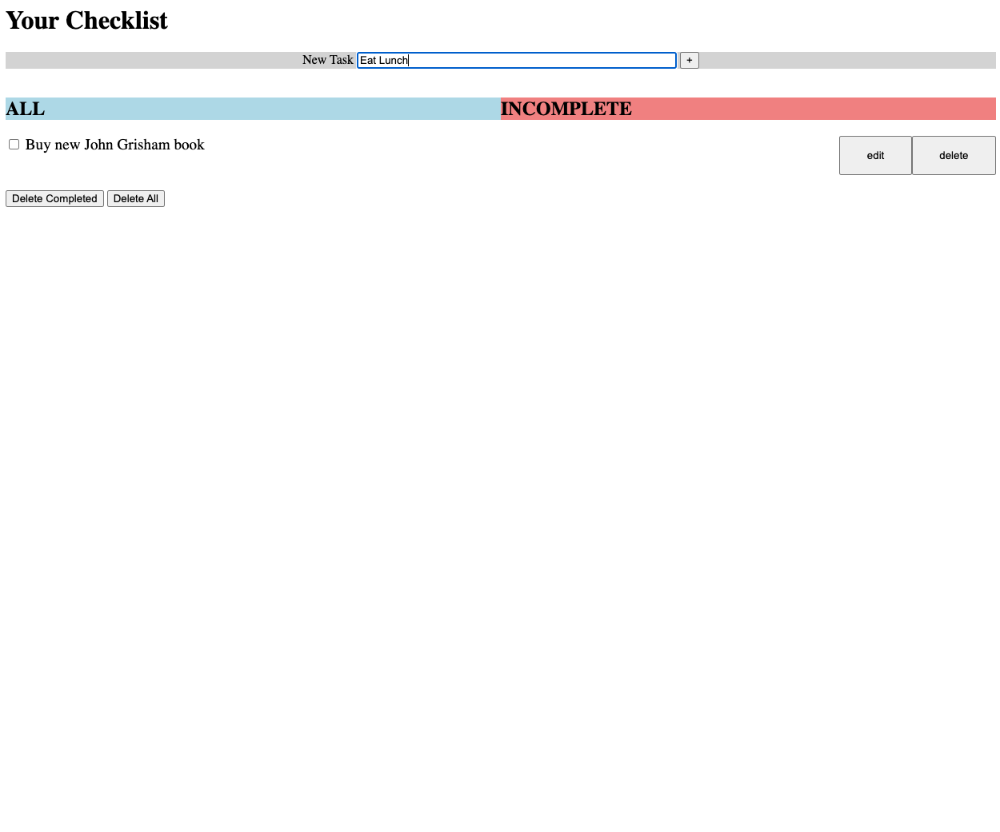
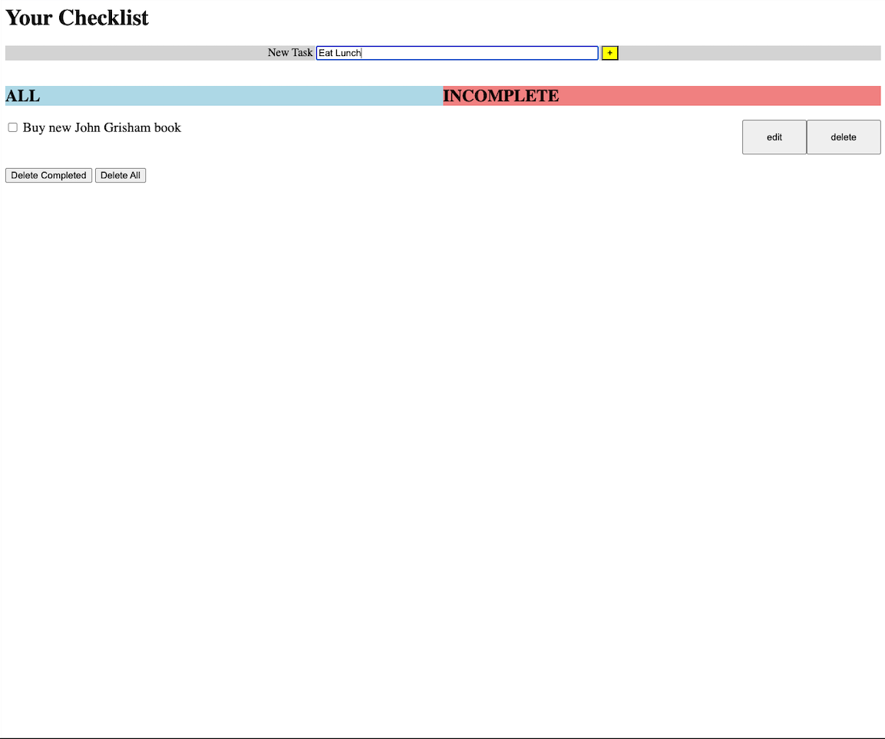
End:
Requires task2_end.html and style.css
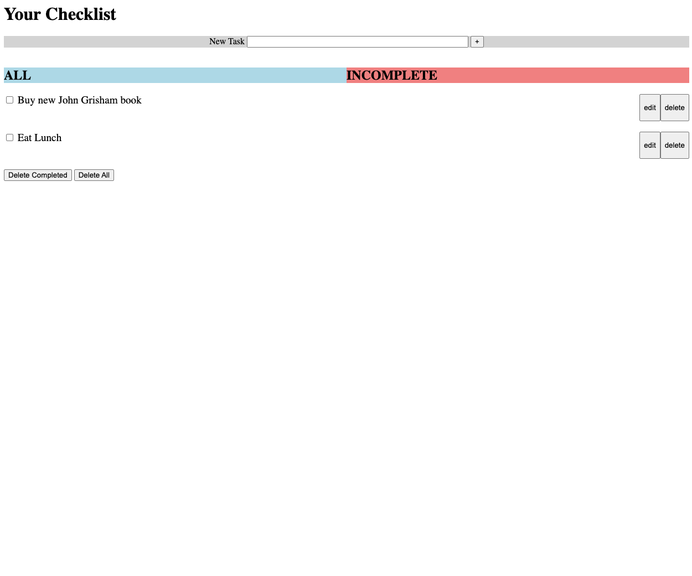

Task 3
------------------------------------------------------
Start:
Requires task3_alltab_start_intermediate_end.html and style.css
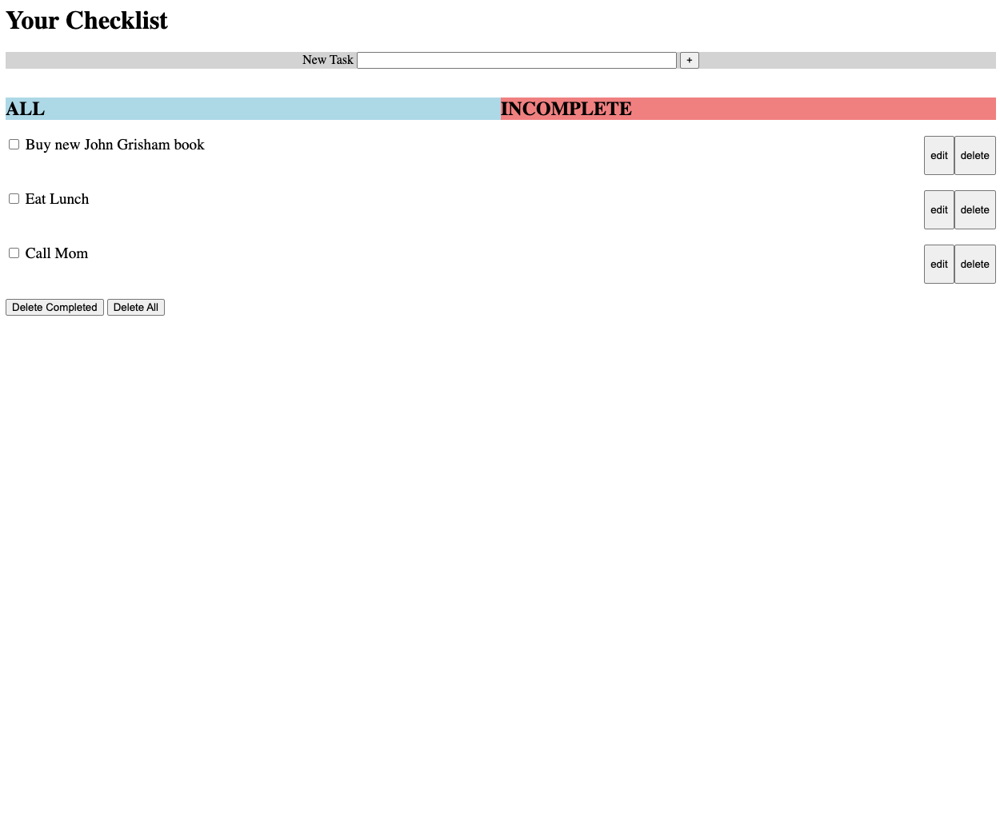
Intermediate:
Requires task3_alltab_start_intermediate_end.html and style.css
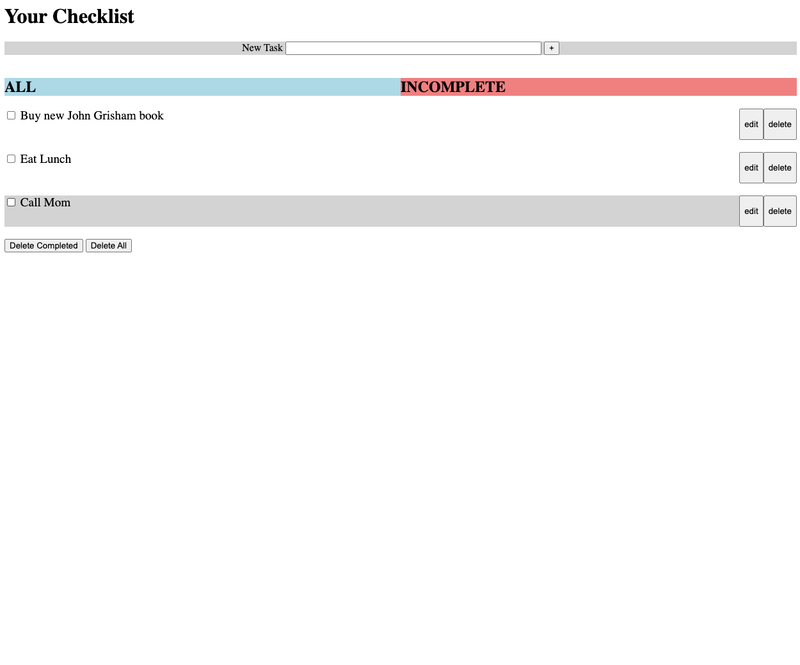
End:
For the end screen, follow comments on coloring tabs in CSS file (blue is the tab you are one and red is the other tab).
 
Also, the strikethrough requires an uncomment of a line in the CSS file under #checkcheck3
Requires task3_alltab_start_intermediate_end.html and style.css
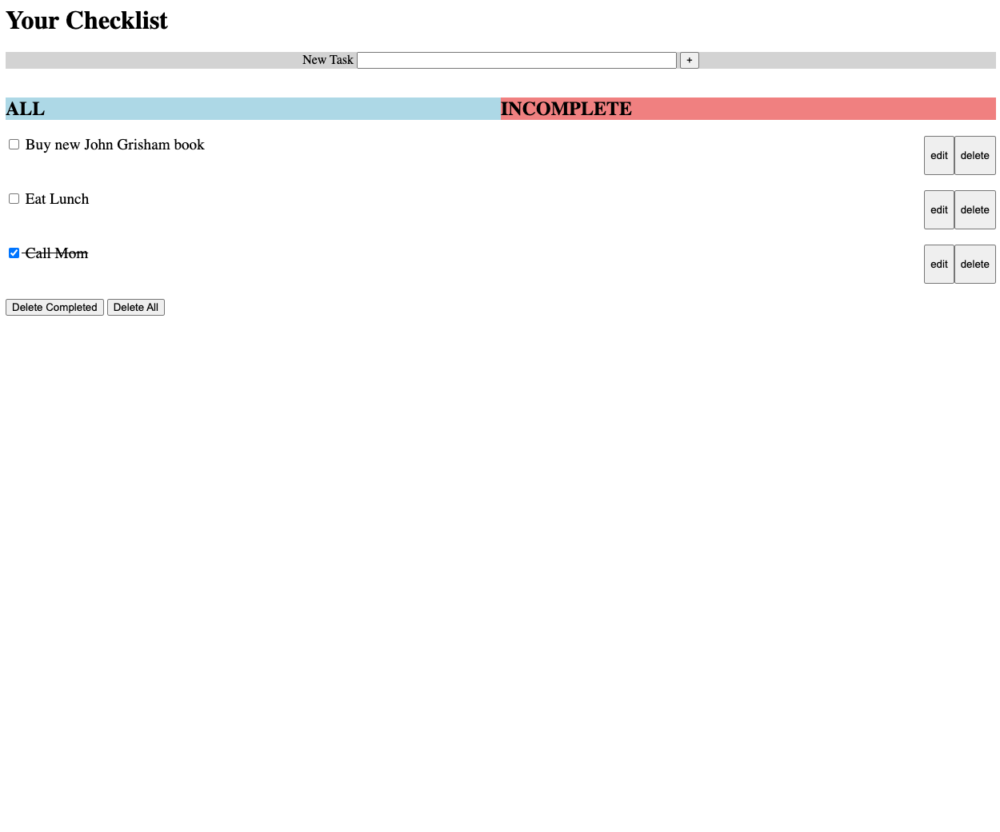
Requires task3_incompletetab_start_intermediate_end.html and style.css
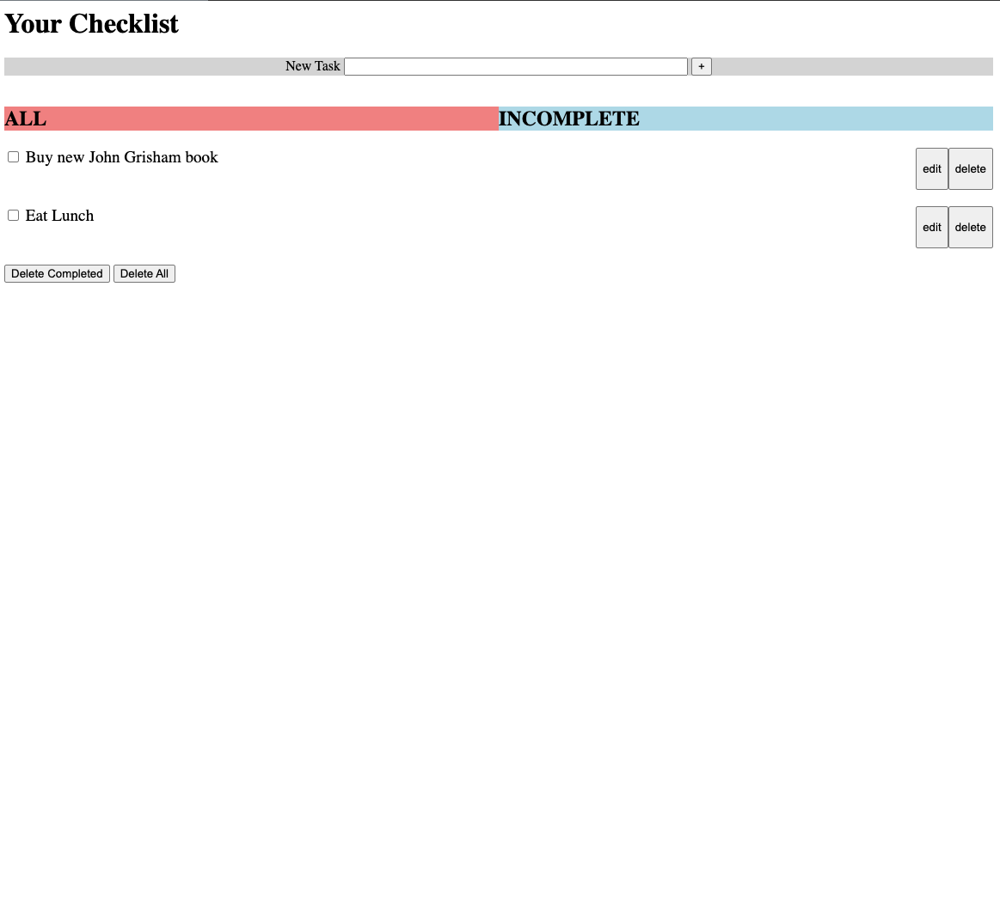

Task 4
------------------------------------------------------
Start:
Intermediate:
End:

Task 5
------------------------------------------------------
Start:
Intermediate:
End:

Task 6
------------------------------------------------------
Start:
Intermediate:
End: