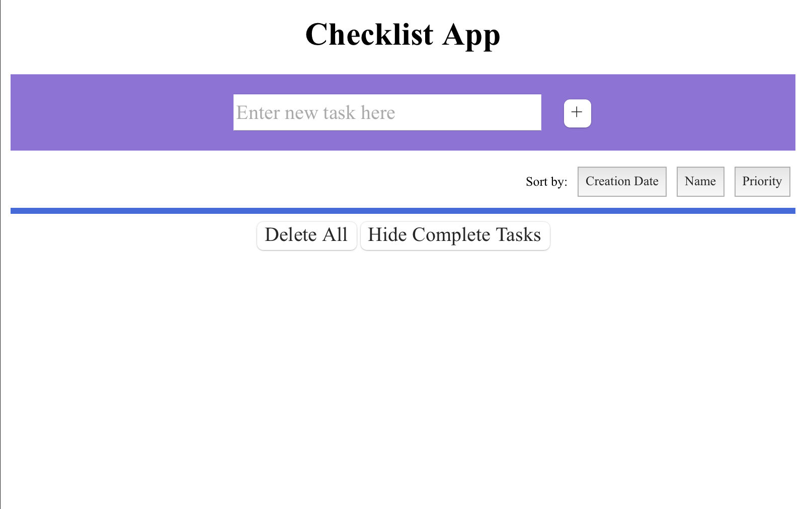
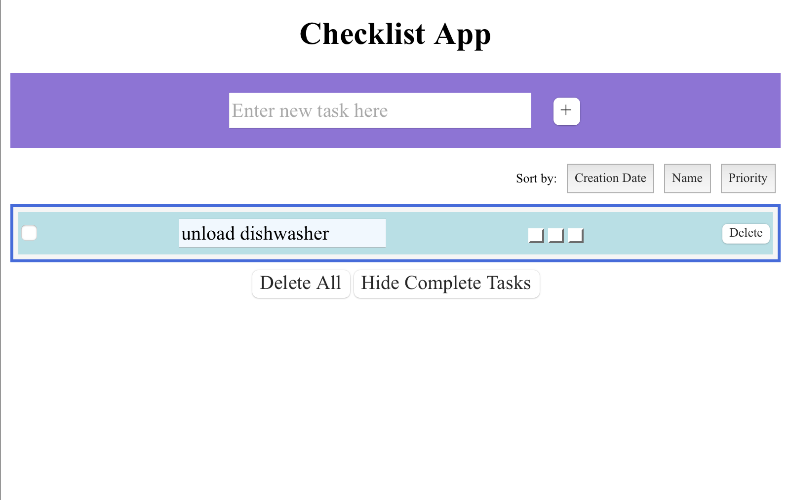
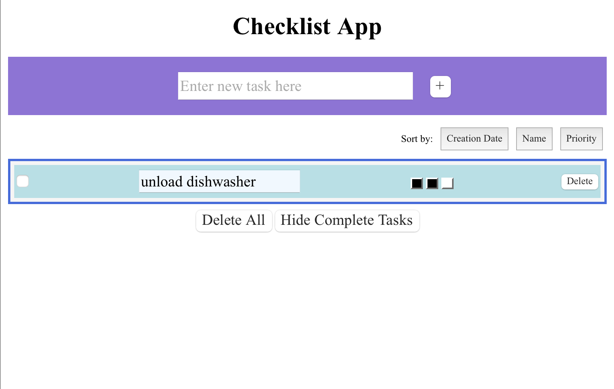
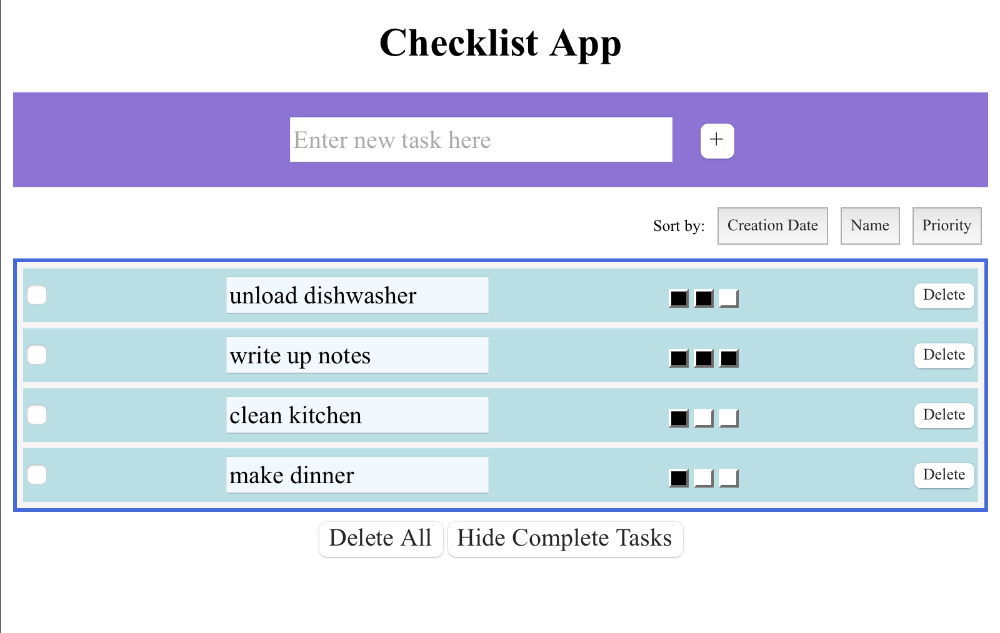
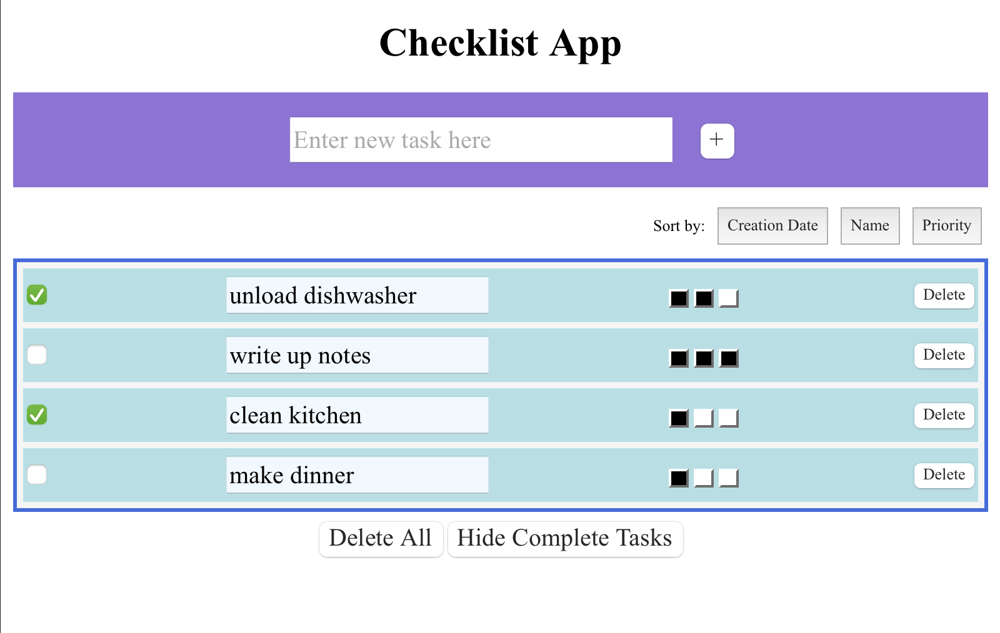
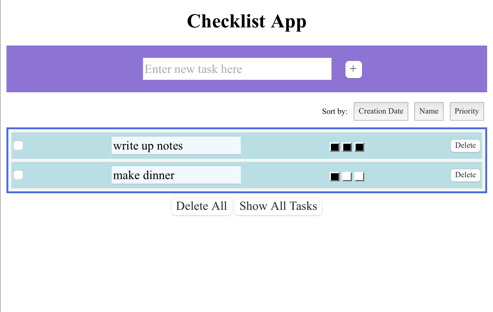
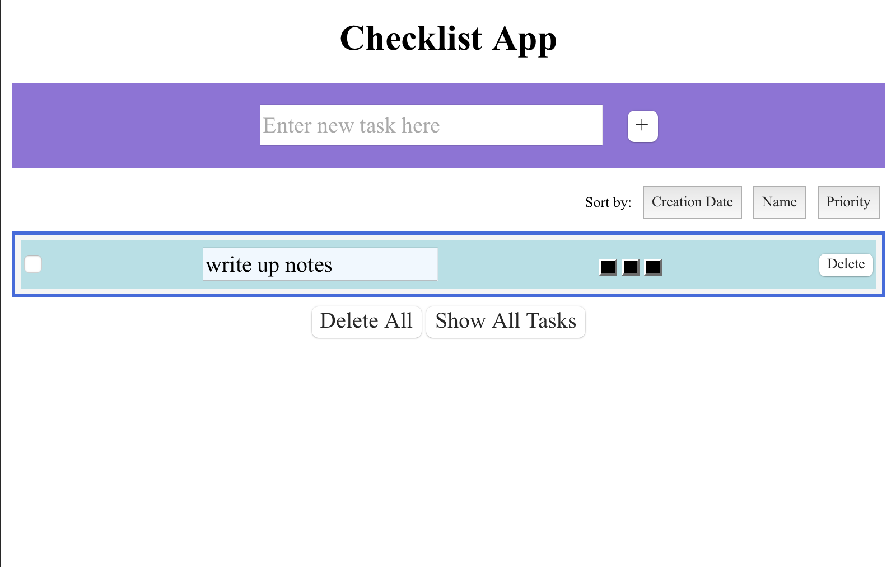
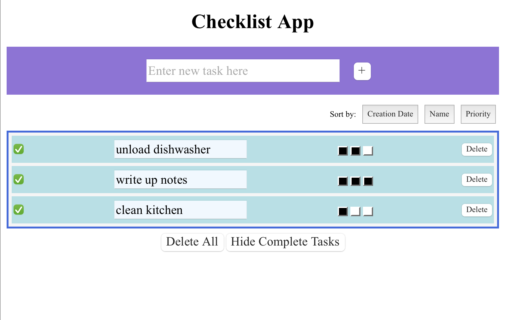

Design Choices Discussion
------------------------------------------------------
**Our Design Decisions**  
We did not make too many design decisions compared to Lab 2. The major visual element we added to our app was the 
priority levels the user can add to various tasks. The goal for this element was for the user to be able to tell the
priority level of a task. It was important to make this element fairly large for the user to see.

Another design decision we made was to place the sorting mechanism between the add task element and the table holding 
the tasks. We placed this element here to connect it to the task table and make it clear that the buttons controlled the
table.

We also centered the tasks within each row of the table in order to make the checkbox more visible.

Lastly, we made the Add task box slightly larger, in order to balance out the space taken up by the task table and 
sorting element.
 
 

**Alternative Designs**  
Alternative designs that were discussed included having the priority buttons be smaller, but we realized this made the
buttons hard to use, particularly when moving across browser types. 
 
 

**User Testing**  
We did not have any additional user testing for this lab.

Final Design Images
------------------------------------------------------
This is the opening image of the app. The user can now proceed to insert a new task in the text box and press the '+'
button to add the task to their checklist. The user may press any of the other buttons at this point if they so like, but
they will not do anything.

-----

Once a user inserts a task the app will look like the following.

----

The user can then set the priority for the task by clicking one of the three buttons on the task line.

----

The user then has the option to add more tasks or work with just the single task in the checklist. The following example 
is what the app will look like if the user adds more tasks.

----

Once tasks are complete the user can click on the checkbox and mark a task as complete.

----

At this point, if the user wants to make their checklist easier to read but don't want to delete their completed items 
just yet, they can hide complete tasks by clicking the corresponding button, and they will end up with a screen similar 
to the one below.

----

The user can then work with the checklist at this point or press the show all tasks button to return to the view shown 
in the previous screenshot.

If the user wishes to delete a specific task, they can simply press the delete button and the task will be deleted.

----

Lastly, if the user wishes to clear their tasks they can press the delete all button and return to back to the opening 
view of the App.

  

Reflection
------------------------------------------------------
**Challenges** 
Our main challenge with this lab was dealing with firestore. We struggled to include the correct doc references and make
the correct queries so that we could access the data we wanted to use. As a result of this we struggled to get our app
to render and perform the functionality we wanted it to. In the end, we were unable to get the sort by buttons functional.
 
 
**What We Are Most Proud Of** 
We are most proud of the fact that we were able to get firestore mostly working in the end (except for sorting by different 
fields). We were really struggling to get that functionality implemented and while we were trying to implement the data storage, 
we ended up breaking the app a couple of times. We were really glad we were able to get the app rendering correctly, and 
able to store data at the same time.