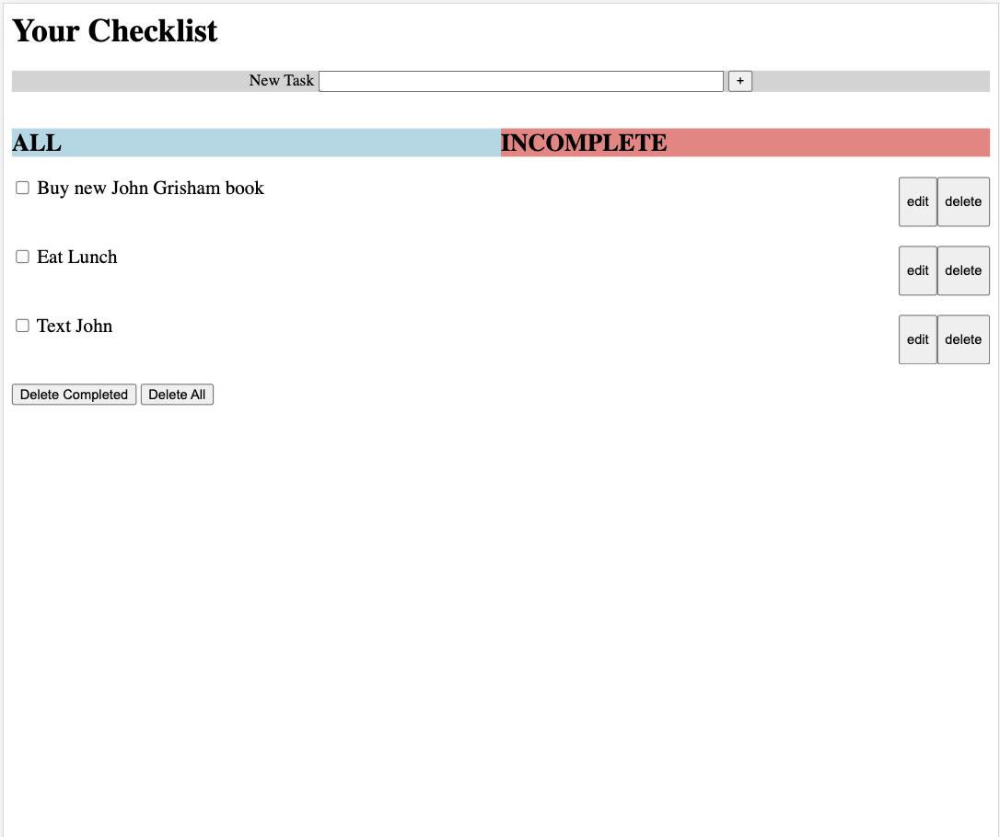
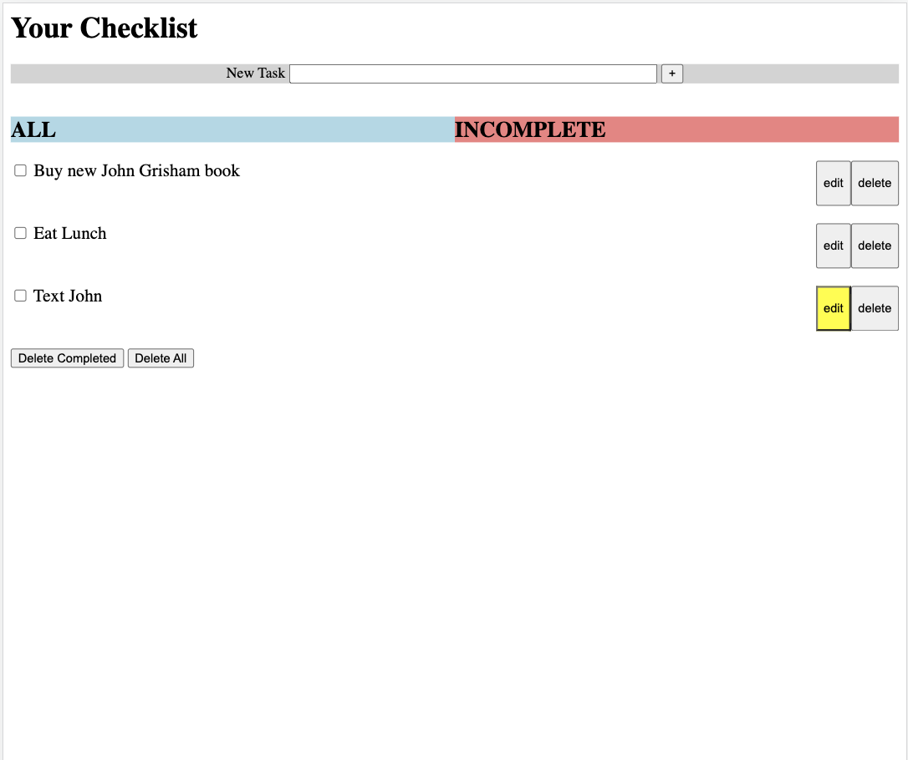
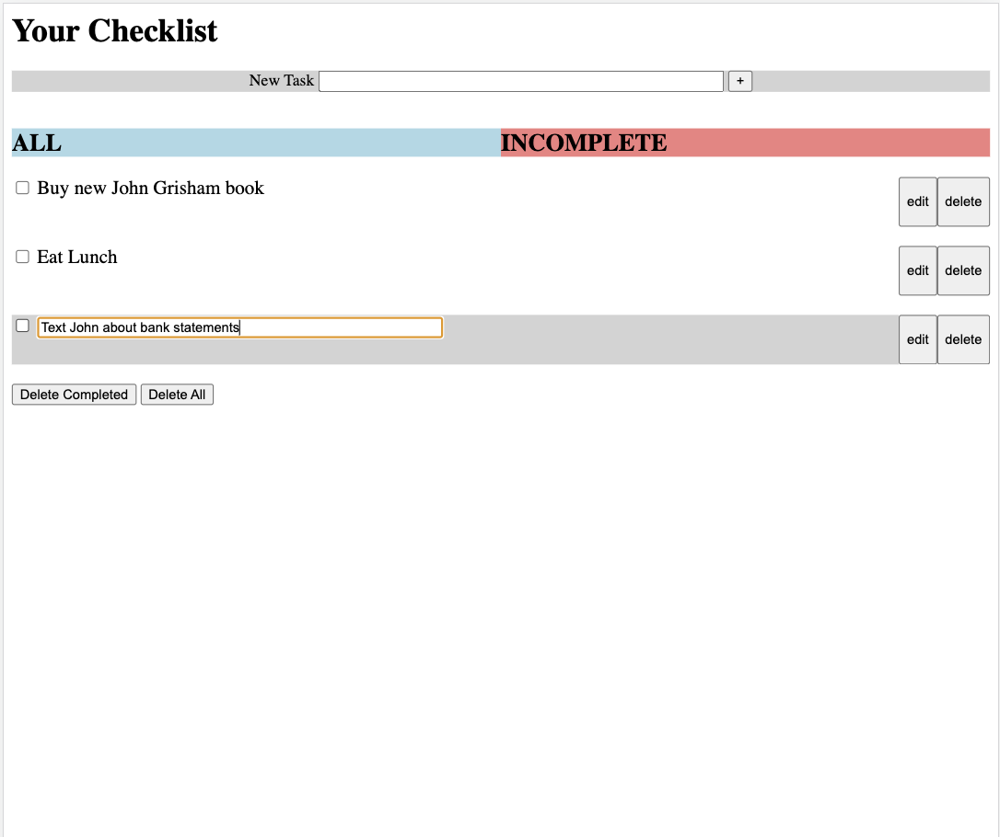
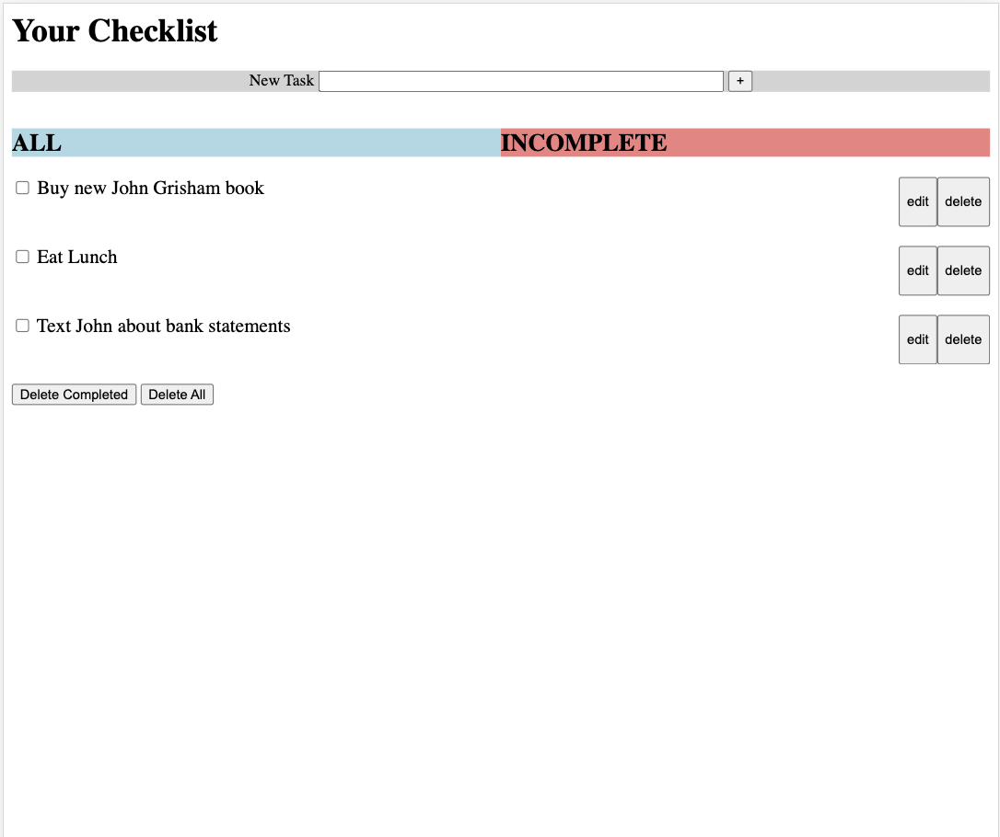
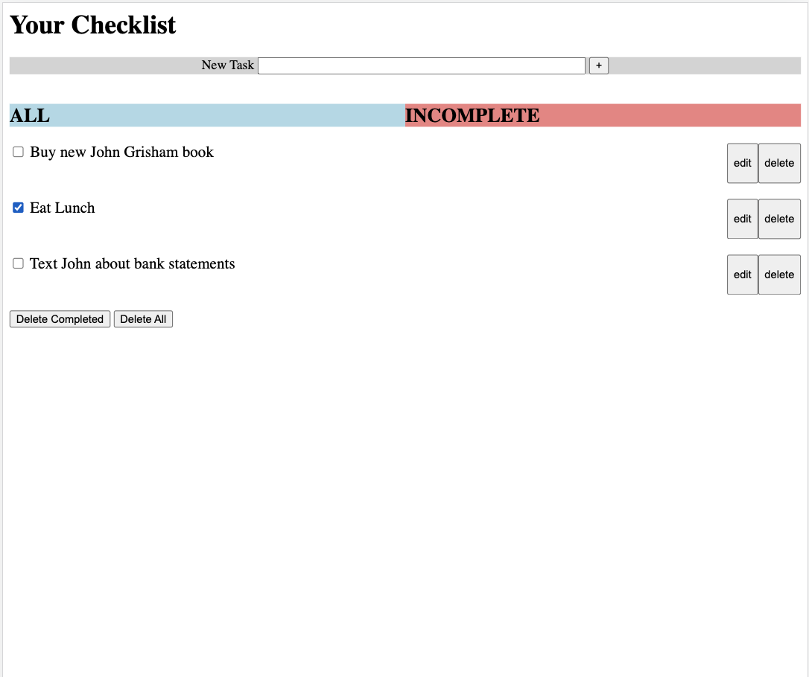
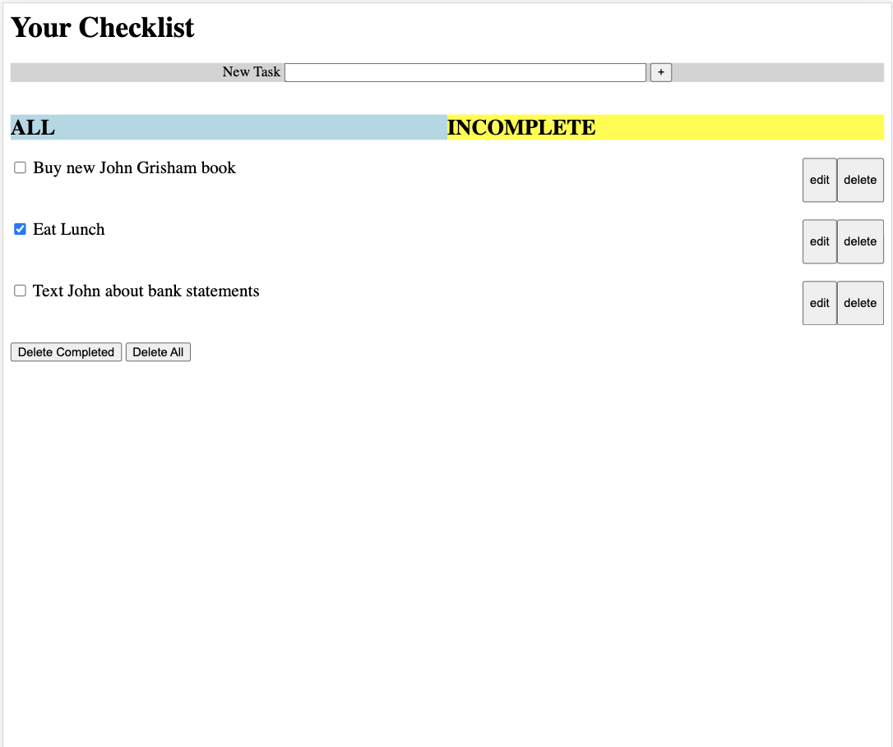
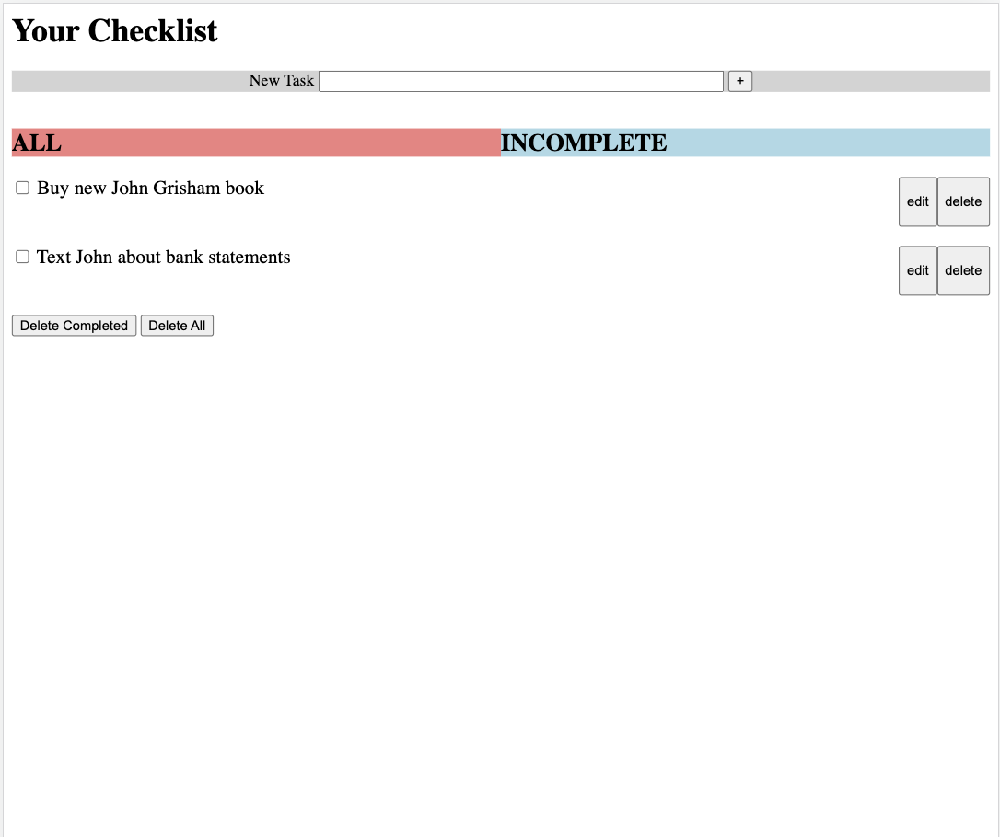
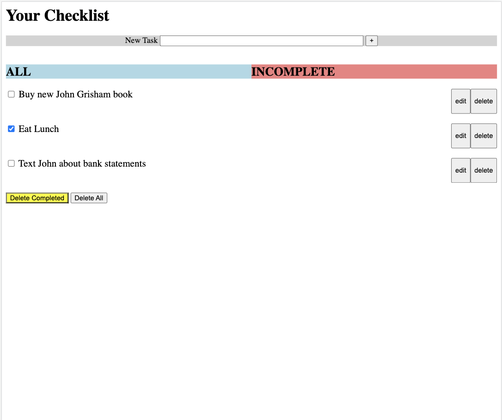
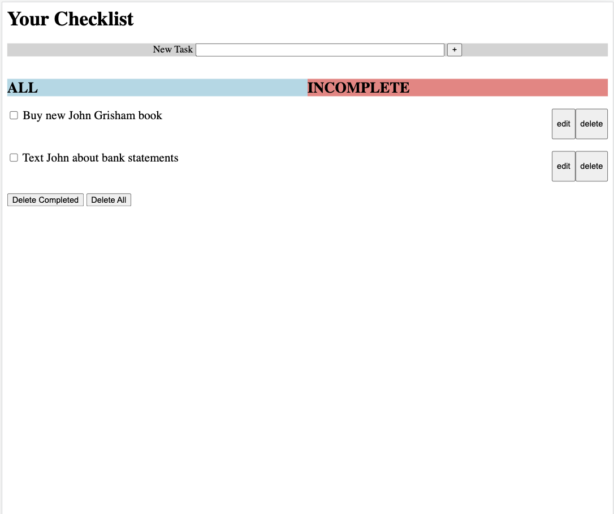

Overall Design Choices
------------------------------------------------------
**Our Design Decisions**  
We decided to place the area where the user could create a new task at the top of the page so that user would have
readily available access to the most basic function of a checklist - putting items on teh checklist. Also, we made sure to make 
the textbox fairly large so that a reasonably long input would be displayed at once in the textbox. Next we placed two
tabs labeled "ALL" and "INCOMPLETE" where the user could sort the items on their checklist. "ALL" is intended to display
all checklist items whereas "INCOMPLETE" displays only incomplete checklist items. The next major design decision we
made was to have an edit and delete button on every checklist item line. We felt these buttons were important as they 
allowed the user to edit and delete specific line items. Lastly at the bottom we placed "Delete Completed" and "Delete 
All" buttons. We chose these two buttons as we thought a user would either want to clean up their list by deleting the 
completed items or start a completely new list in which case they would want to delete all. We specifically made the decision
to add the "Delete Completed" button to both tabs so that someone on the "INCOMPLETE" tab does not have to navigate back
to the "ALL" tab if they are sure they want to get rid of any completed tasks. If the user wants to check that they truly
wish to delete all completed tasks, then they could simply navigate back to the "ALL" tab to do so.
 
 
**Alternative Designs**  
Some alternative designs we considered were different labels of components and different designs of buttons. We ended
up going with our final design due to other hurdles we encountered while building this checklist. We also considered only 
adding the "Delete Completed" button to the "ALL" tab, but we decided against this due to the reasons discussed above.

**User Testing**  
We did not do any outright user testing, but we did consider our own relationship with this checklist and what we might 
want out of the design.

**Final Design Images** 
See below for screenshots of our webpage through different stages of each of the six tasks.

**Challenges** 
One specific challenge we faced is with flexbox and gridbox design. We intitially tried to create one gridbox that dealt
with the outer table (everything other than the create new task bar) and adding each new task as a row in the gridbox. We were having trouble controlling grandchild
elements and eventually came to the realization that gridbox/flexbox can only control direct children (with the guidance of Prof. Rhodes). We then changed 
the structure to a gridbox where every line that contained a checklist item was its own flexbox. By breaking up what 
various parents had to do, we were able to achieve the desired design.
 
 
**What We Are Most Proud Of** 
One design choice that we are most proud of is giving the user a choice between an all tasks tab and an incomplete tasks 
tab. While it may not seem as necessary when the list only contains three or four items, if the list builds up, it will
be very convenient to see what still needs to be completed at the click of a button.

Task 1
------------------------------------------------------
Start:
Requires task1_start_intermediate.html and style.css

Intermediate:
Requires task1_start_intermediate.html and style.css

End:
Requires task1_end.html and style.css

Task 2
------------------------------------------------------
Start:
Requires task2_start_intermediate.html and style.css

Intermediate:
Requires task2_start_intermediate.html and style.css

End:
Requires task2_end.html and style.css

Task 3
------------------------------------------------------
Start:
Requires task3_alltab_start_intermediate_end.html and style.css

Intermediate:
Requires task3_alltab_start_intermediate_end.html and style.css

End:
For the end screen, follow comments on coloring tabs in CSS file (blue is the tab you are one and red is the other tab).
 
Also, the strikethrough requires an uncomment of a line in the CSS file under #checkcheck3
Requires task3_alltab_start_intermediate_end.html and style.css

Requires task3_incompletetab_start_intermediate_end.html and style.css

Task 4
------------------------------------------------------
Start:
Requires task4_start.html and style.css

Intermediate:
Requires task4_start.html, style.css, and clicking on the edit button.

Requires task4_intermediate.html, style.css, and the user typing in the renamed title.

End:
Requires task4_end.html and style.css

Task 5
------------------------------------------------------
Start:
Requires task5,6_start_intermediate.html, style.css, along with a manual checking of the "Eat Lunch" task. 

Intermediate:
Requires task5,6_start_intermediate.html, style.css, clicking on the incomplete tab, and manual check of "Eat Lunch".

End:
Requires task5,6_end.html, style.css, and the uncommenting of light blue as the background color for "incomplete", 
light coral for "all"

Task 6
------------------------------------------------------
Start:
Requires task5,6_start_intermediate.html, style.css, and manual clicking of the "Eat Lunch" task checkbox.

Intermediate:
Requires task5,6_start_intermediate.html, style.css, manual clicking of "Eat Lunch" checkbox, and clicking on the 
"Delete Completed" button.

End:
Requires task 5,6_end.html and style.css
