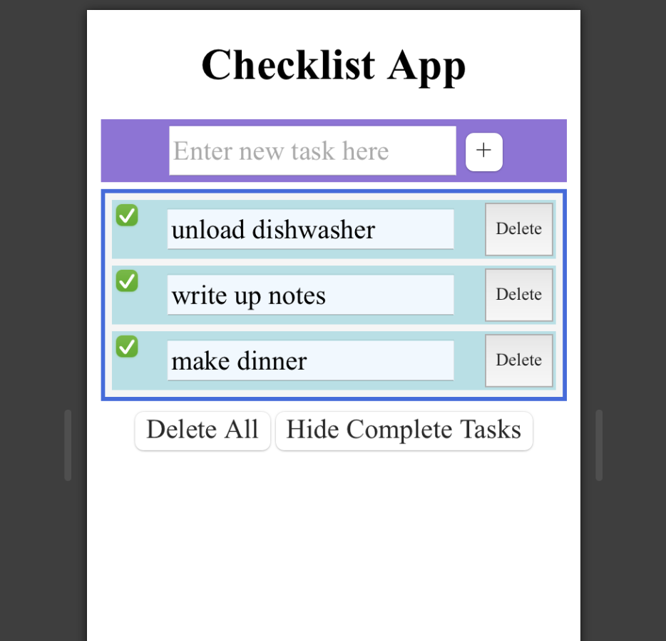

Design Choices Discussion
------------------------------------------------------
**Our Design Decisions**  
We did not make too many design decisions compared to Lab 2. The major visual element we added to our app was the 
priority levels the user can add to various tasks. The goal for this element was for the user to be able to tell the
priority level of a task. It was important to make this element fairly large for the user to see.

Another design decision we made was to place the sorting mechanism between the add task element and the table holding 
the tasks. We placed this element here to connect it to the task table and make it clear that the buttons controlled the
table.

We also centered the tasks within each row of the table in order to make the checkbox more visible.
 
 

**Alternative Designs**  
Alternative designs that were discussed included having the priority buttons be smaller, but we realized this made the
buttons hard to use, particularly when moving across browser types. 
 
 

**User Testing**  
The user testing went well, the user was able to accomplish all the tasks we set out for them. The one issue they had 
was with finding the checkbox. After looking at the App we realized we did not implement the color backgrounds for each 
individual task. We then proceeded to implement this feature.

Final Design Images
------------------------------------------------------
This is the opening image of the app. The user can now proceed to insert a new task in the text box and press the '+'
button to add the task to their checklist. The user may press any of the other buttons at this point if they so like, but
they will not do anything.

-----

Once a user inserts a task the app will look like the following.

----

The user then has the option to add more tasks or work with just the single task in the checklist. The following example 
is what the app will look like if the user adds more tasks.

----

Once tasks are complete the user can click on the checkbox and mark a task as complete.

----

At this point, if the user wants to make their checklist easier to read but don't want to delete their completed items 
just yet, they can hide complete tasks by clicking the corresponding button, and they will end up with a screen similar 
to the one below.

----

The user can then work with the checklist at this point or press the show all tasks button to return to the view shown 
in the previous screenshot.

If the user wishes to delete a specific task, they can simply press the delete button and the task will be deleted.

----

Lastly, if the user wishes to clear their tasks they can press the delete all button and return to back to the opening 
view of the App.

  

Reflection
------------------------------------------------------
**Challenges** 
One of our main challenges was in implementing the Hide Complete Tasks button. This was a two-step process because we needed
to make sure the data was only being changed (to hide specific tasks) when the 'Hide Complete Tasks' button was pressed. In
addition, we needed to keep track of completed (or checked) tasks. This was especially challenging because we had initially
tried to change the completed field for tasks (which is immutable). After assistance from Prof. Rhodes, we were able to implement
keeping track of completed status using 'setData'.

Another big challenge we had was in creating the AddTask component. Specifically, it was difficult to figure out adding a 
new task into the data. While we knew that we would need to use 'setData', we had some trouble with getting the correct JavaScript
syntax for adding an element to a list. With more time, we aim to figure out how to add an element to the 
front of a list rather than the back. Then, the newly added tasks would be added to the top.
 
 
**What We Are Most Proud Of** 
We are most proud of the fact that we were able to get our button toggling between showing all the tasks and showing 
the incomplete tasks. This feature took quite a lot of time to get right and involved a lot of tracing properties through
different components. Because there were so many property names to keep track of, it was important to stay consistent with
what we called each property. Ultimately, we were able to use a 'handleTextFieldChange' function and a showCompleted state
together in order to implement this function. In the end, we were able to get it working as we intended.