Design Choices Discussion
------------------------------------------------------
**Our Design Decisions**  
We decided to prioritize functionality for this lab and so while we did try to maintain the major design elements 
from our original list design, we did not fully change the design for all the components. We chose to go with a more
simplistic look to make the buttons and various screens easier to navigate.

 
 

**Alternative Designs**  
Alternative designs that were discussed included having a more consistent design across various pages, which would have 
included a 'Lists' homepage that looked very similar to the actual checklist page (same types of elements inside and outside
 the border) and a sign-in page that was more similar to our checklist page in terms of theme (color, similarly boxed elements,
etc.)
 
 

**User Testing**  
We did not have any additional user testing for this lab.

Final Design Images
------------------------------------------------------
When the user opens the app they will see the sign-in page.

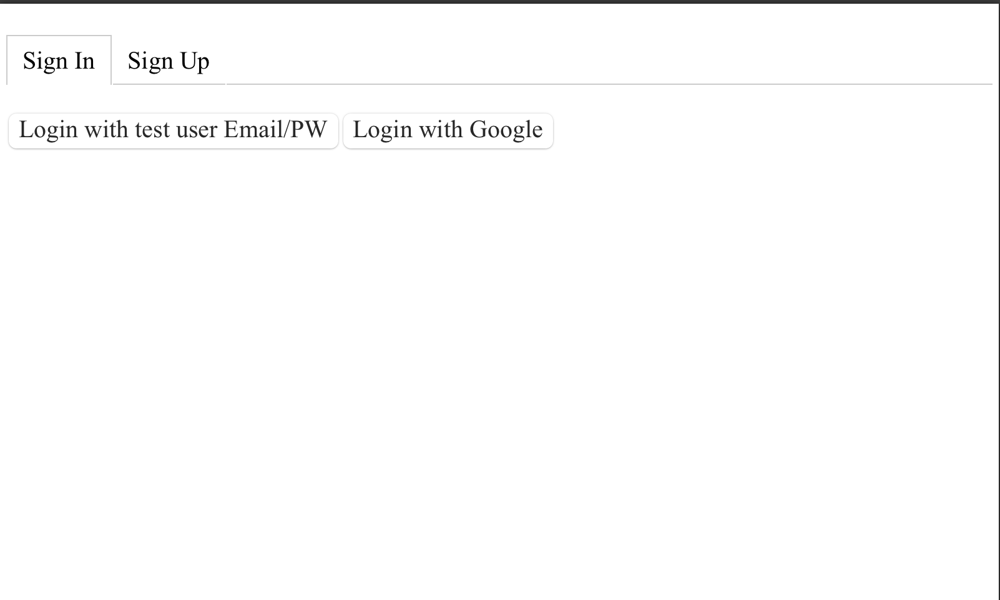

The user has the ability to tab between pages and they could press the 'Sign Up' tab and get to the following screen.

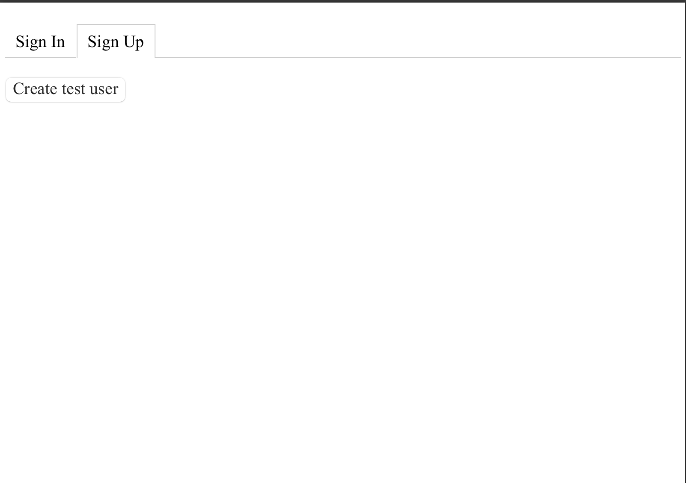

The button on this page is not yet functional. For actual functionality, the user must go back to the 'Sign In' page.

-----
The user can then choose multiple ways to sign in or sign up. They can then press the Login with test user Email/PW and 
get to the following screen.

Alternatively the user can press the login with Google which has full functionality, but the structure of the database 
makes all lists available to all users, effectively making this button the same as using the test user button.

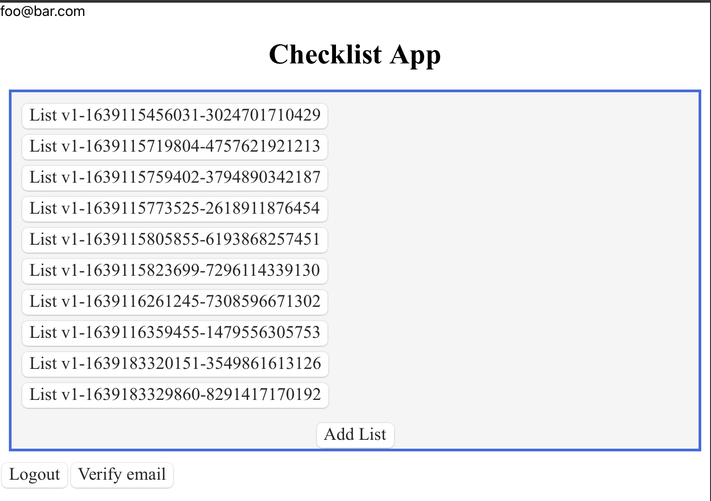

The 'Verify Email' button at the bottom of the image is not functional.

-----
Next, the user can select a list they would like to work on and then move on to the checklist part of the app as shown below.

Additionally, if at any point the user would like to log out they can press the logout button and return to the opening 
page.

-----

This is the opening image of the checklist part of the app as previously described. The user can now proceed to insert a new task in the text box and press the '+'
button to add the task to their checklist. The user may press any of the other buttons at this point if they so like, but
they will not do anything.

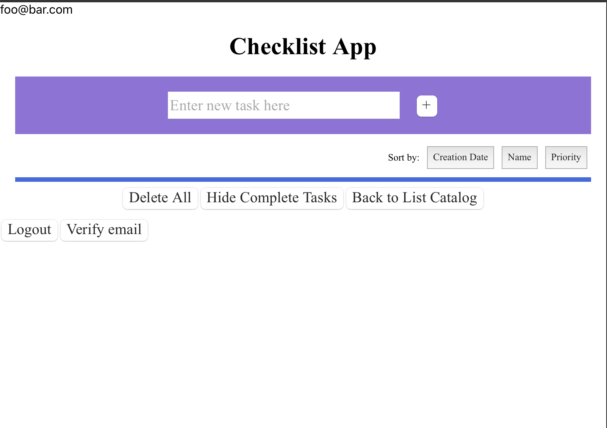

If the user would like to navigate to a different list they can press the 'Back to List Catalog' button, and it will take 
them to the previous screen.

-----

Once a user inserts a task the app will look like the following.

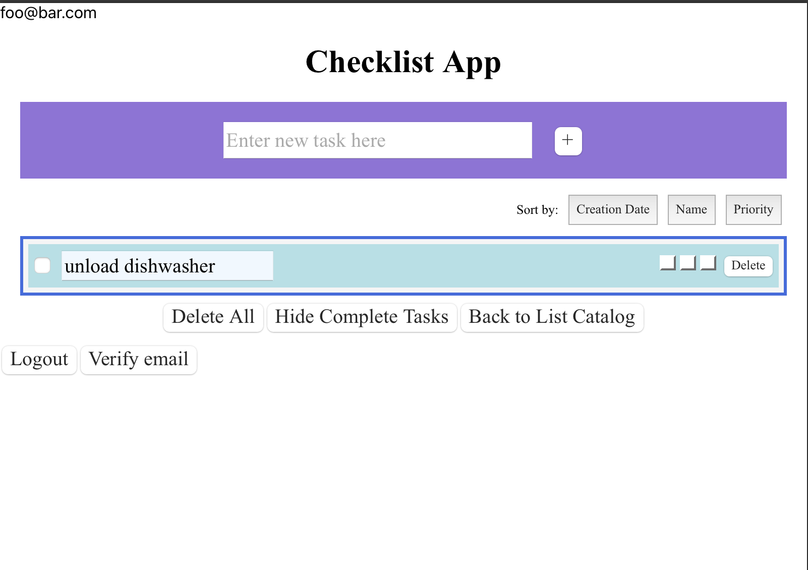

----

The user can then set the priority for the task by clicking one of the three buttons on the task line.

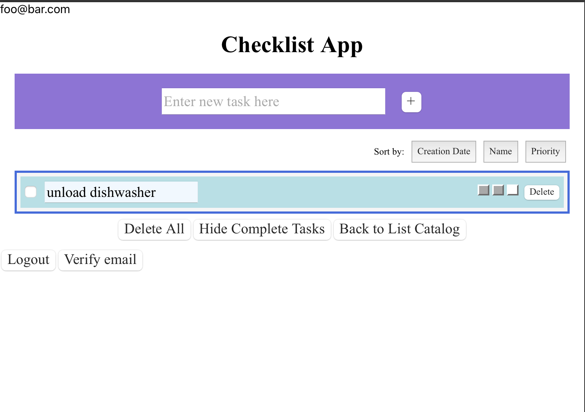

----

The user then has the option to add more tasks or work with just the single task in the checklist. The following example 
is what the app will look like if the user adds more tasks.

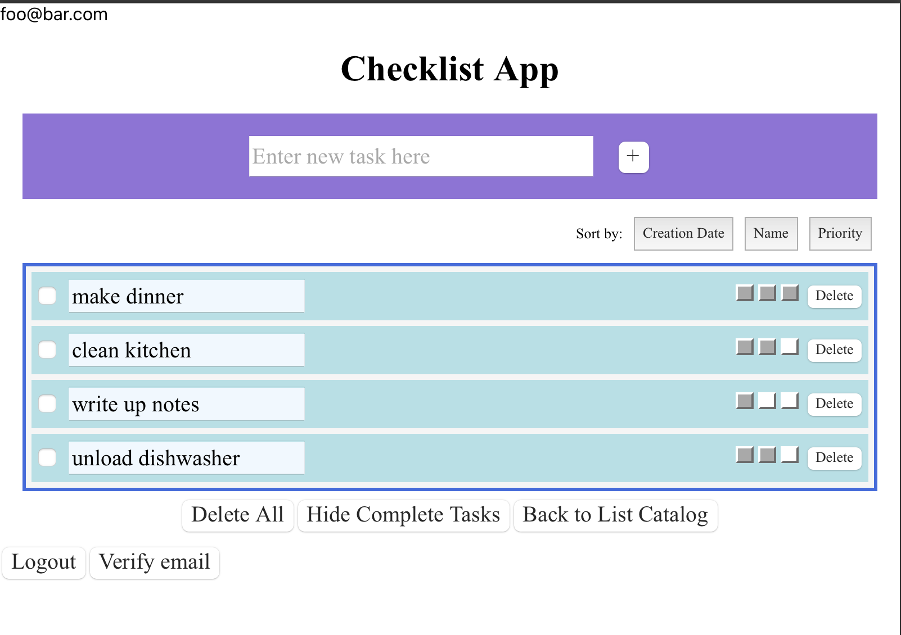

----

Once tasks are complete the user can click on the checkbox and mark a task as complete.

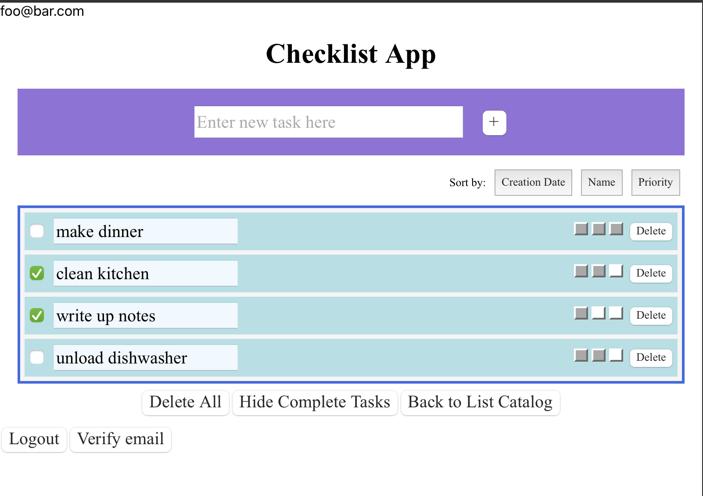

----

At this point, if the user wants to make their checklist easier to read but don't want to delete their completed items 
just yet, they can hide complete tasks by clicking the corresponding button, and they will end up with a screen similar 
to the one below.

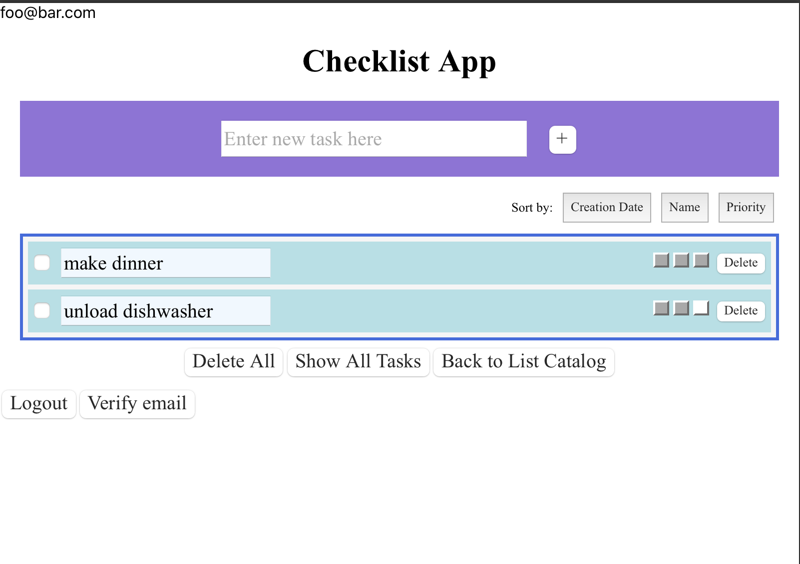

----

The user can then work with the checklist at this point or press the show all tasks button to return to the view shown 
in the previous screenshot.

If the user wishes to delete a specific task, they can simply press the delete button and the task will be deleted.

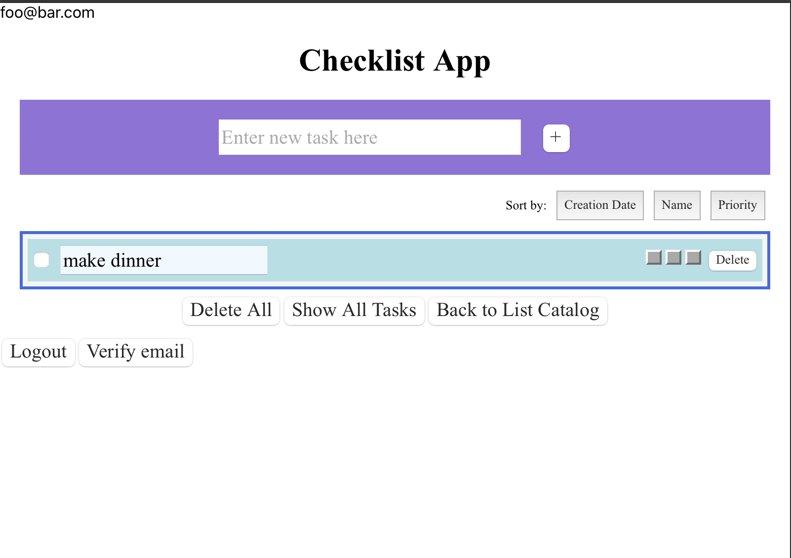

----

Lastly, if the user wishes to clear their tasks they can press the delete all button and return to back to the opening 
view of the App.
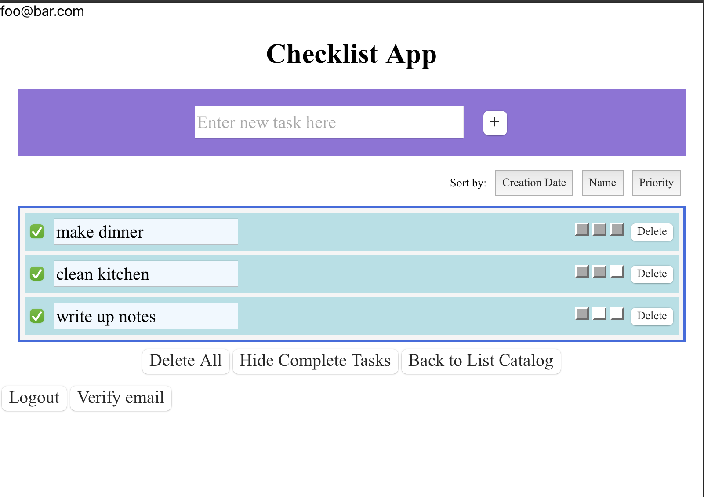

  

Reflection
------------------------------------------------------
**Challenges** 
Our main challenge was in getting the authentication rules to work. We were able to easily take in the Google Authentication 
and apply it to our web app, but we had some difficulty getting the email and password login working because we had some 
difficulty understanding how to work with text type input's values for the email and passwords in order to use 
createUserWithEmailAndPassword and signInWithEmailAndPassword. Another challenge we had was in understanding how to use 
the rules to get the sharing working. Ultimately, due to lack of time, we did not end up implementing either the signing 
in with email and password or the list sharing.
 
 
**What We Are Most Proud Of** 
One thing that we spent a lot of time working on was the implementation of adding multiple lists. We were not able to 
finish implementing this for the last lab. We had considered skipping the implementation and focusing on authentication, 
but after organizing our code a little bit, it was easier to understand how to implement the list of lists (as well as 
how Firestore factors into everything). Overall, while we wish we could have implemented deleting lists and naming lists, 
we are glad that we were able to implement this functionality.